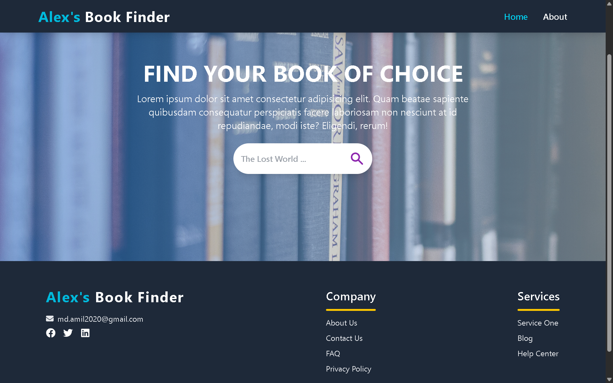
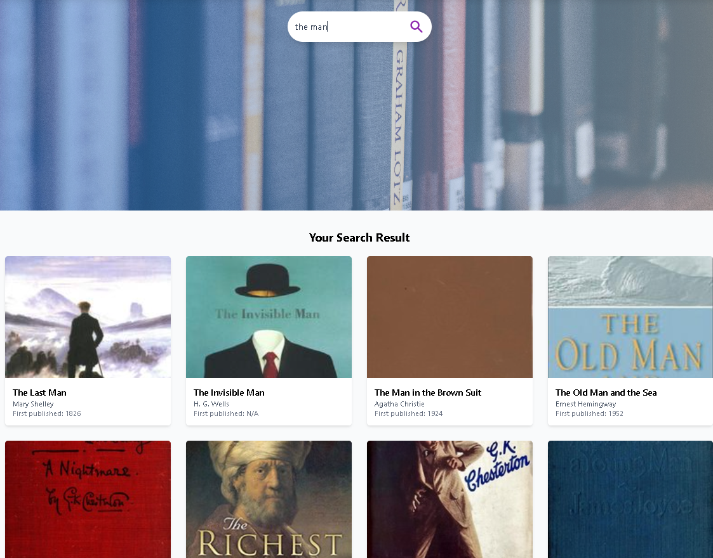
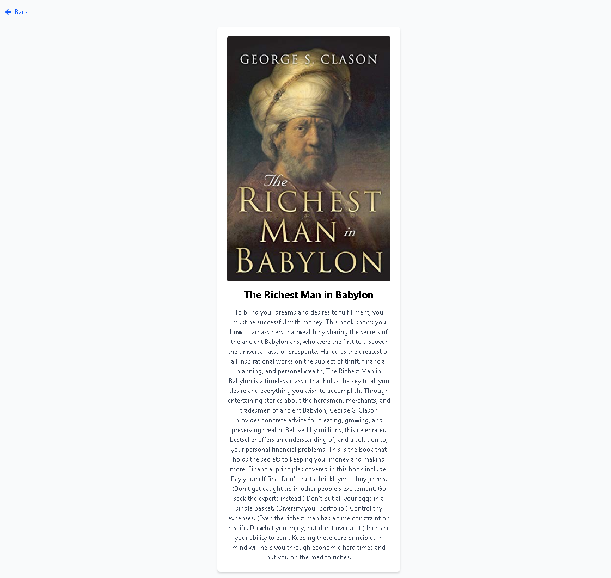

# Alex's Book Finder

A book discovery app built with React and styled using TailwindCSS. It integrates with the Open Library API to help users find books by it's title.

## Tech Stack

- **Frontend**: React
- **CSS Framework**: TailwindCSS
- **API**: Open Library API

## Live Demo

You can try out the app live on StackBlitz:

[Check it out on StackBlitz](https://stackblitz.com/~/github.com/mdamill/Alex-s-Book-Finder)

## 📸 Screenshots

### 🌟 Homepage

### 🌟 Search Results

### 🌟 Book Details

### 🌟 Not Found

---
